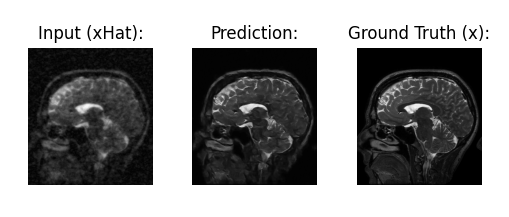

<h1 align="center">Hi, I'm Harry Gao. Welcome to my GitHub. </h1>
<h4 align="center">I'm majoring in Computer Science + Math with a minor in Psychology at Washington University in St. Louis. I'm passionate about machine learning for good and learning about cutting-edge technologies. My GitHub profile is a glimpse into my growth through my academic journey, from creating simple games to building full-stack websites with deployed ML models. I'm looking forward to expanding my knowledge and experience!</h4>
 

## Some Cool Things I've Done Recently

### 👉 Monet Painting Generator with CycleGAN

<h4>To learn more about generative models and to learn how to deploy models, I created and trained a CycleGAN model to translate photos into Monet paintings. The data was obtained from <a href="https://www.kaggle.com/competitions/gan-getting-started">this</a> Kaggle competition, where I also submitted the final model.</a></h4>

<a href="https://github.com/harrygao56/CycleGAN-Monet">Repo</a>

### 👉 MRI Reconstruction
<h4>As an exploration into machine learning for medical imaging, I implemented a Denoising Neural Network that is trained to remove noise from an MRI scan. It turned out pretty well:</h4>

<a href="https://github.com/harrygao56/MRI-Reconstruction-DnCNN">Repo</a>
